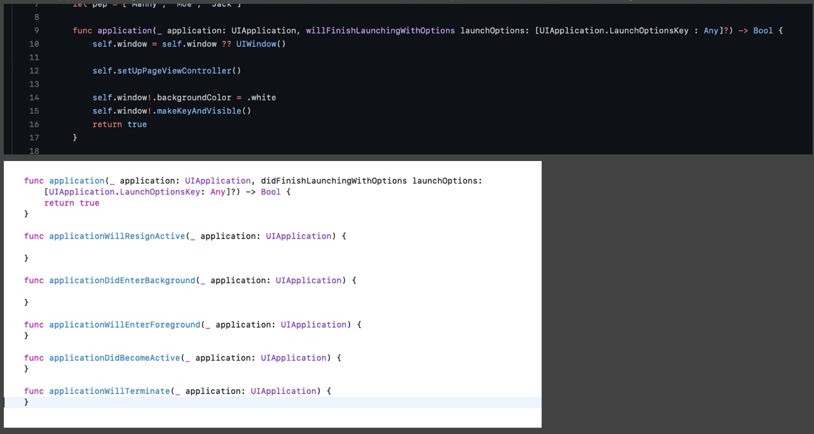

App life cycle

Che cosa è? Il ciclo di vita della nostra app, chi lo gestisce, da dove parte e come possiamo sfruttarlo.

Partiamo con il dire che fino ad ios 12 la user interface e la app cycle erano concatenate tra di loro

1. L’utente clicca sulla icona app > avvia la classe “UIApplicationMain(_:_:_:_:)”, la quale crea una istanza di “UIApplication” (uno per app, non più istanze singola app) il quale è un singleton accessibile da “shared”; conforme al protocollo “UIApplicationDelegate”, il compito di questa classe è registrare i vari eventi della app, sia utente che non avviare la schermata iniziale - Root of the app. 
2. Con il delegate riceve e gestisce eventi esterni/interni app. (touch, notifiche, app state….)
3. UIApplication singleton manda notifiche a chi lo ascolta di vari eventi della app es. se è stata aperta, se background ecc..

Quando lancio l’app i metodi che vengono chiamati sono: “Application WillFinishLaunchingWithOptions” e “Application DidFinishLaunchingWithOptions”. Solitamente nell’ultimo indicato, abbiamo il nostro setup dalla prima view da presentare

- Will Finish > sta per finire di lanciare
- Did Finish > ha finito di lanciare
- Will Terminate > sta per essere chiusa
- Memory > se occupa troppo la killa

- Become Active > è apparsa, ripresa, sia appena lanciata che riapparsa
- Resign > sta andando via
- Foreground > dal background al active state
- Background > active to back, si hanno circa 5 secondi per fare salvataggi o altro, altrimenti usa beginbackgroundtask

Si possono avere solo una istanza di app aperta alla volta. Application delegate è notificato da il lavoro sia di application che user interface. In sostanza, una scena - una app.

Cosa è successo da ios 13 in poi? Ios diventa: Scene-based API

- Application life cycle e User Interface life cycle si sono divise
Come mai questo? Poiché ora le app possono avere più interfacce utente, pensiamo al iPad il quale può avere più schermate aperte nella stessa pagina.
Quindi… abbiamo ora due “gestori” separati, uno per Application life cycle (uno singolo), e uno per user interface il quale viene gestito da “UIWindowSceneDelegate”. > SceneDelegate e accetta più interfacce, una app più interfacce
Ha il compito di gestire le singole scene, il loro stato

Ogni scena ha il proprio stato e gestione. Ma tutte sempre collegate ad un singolo “UIApplication”.
Processi app generali:

AppDelegate Before ios 13 (storyboard)

Senza storyboard

AppDelegate dopo ios 13 > Scene-based app

Qui manca la parte “window”, dove sono impostate le scene. Ma abbiamo 2 nuovi metodi riguardanti le scene
“ConfigurationForConnecting” serve al sistema per capire quale configurazione di base usare per creare la scena
“didDiscardSceneSession” metodo base per chiudere scena
Possiamo comunque contiunare a gestire qui la ricezione di notifiche ecc.

Lo Scene Delegate

Nel info.plist abbiamo una configurazione > “Enable multiple windows” il quale se l’app è impostata s ipad è yes altrimenti no
I vari metodi funzionano come prima nel app delegate, fanno la stessa cosa, il punto è che ogni scena ha la sua gestione e non più generale

Con SwiftUI ios 14
Ora abbiamo il protocol “App” alla nostra classe root (indicata come @main, metodo di App per dire chi inizia) 
@main
struct BooksApp: App
{
var body: some Scene {
WindowGroup {
BookList()

“Scene” > NON VIEW! Indica che abbiamo una scena della app, non tutti l’hanno di base
“WindowGroup” > cross platform Instance che contiene gli adattamenti di UIWindow
BookList > dichiariamo la prima view

Ma come gestiamo i vari stati?
Per inizializzare un qualcosa possiamo comunque usufruire del metodo init
init() {
Bugsnag.start()
}

Per gli stati:

I quali ora sono diventati 3: active, inactive, background

(app switcher > colui che gestisce il transito tra le varie app)

Che succede se vogliamo il vecchio AppDelegate per gestire altri stati? “UIApplicationDelegateAdaptor”

Visto che non tutti i metodi sono ancora disponibili, tipo per ricevere le notifiche, ecco come torno ad usare app delegate e tutti i suoi metodi!
Qui definiamo UIApplicationDelegateAdaptor e gli diciamo > usa l’AppDelegate, non la struttura nuova di swiftui
