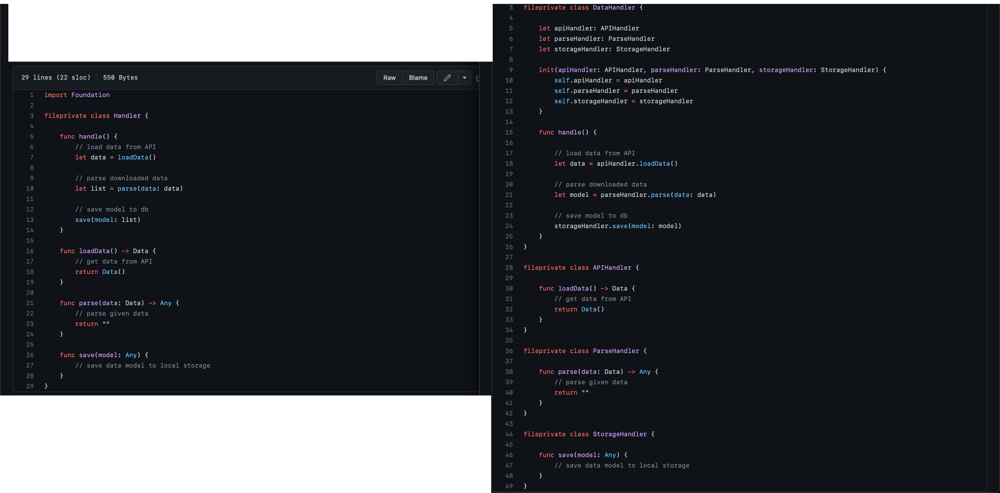
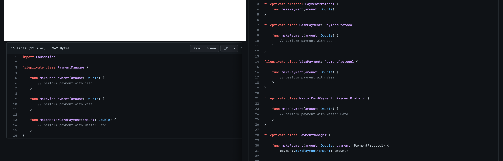
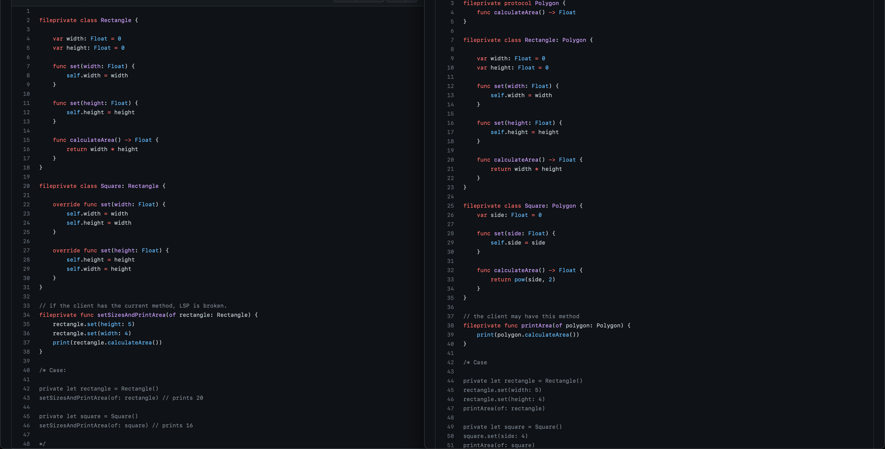
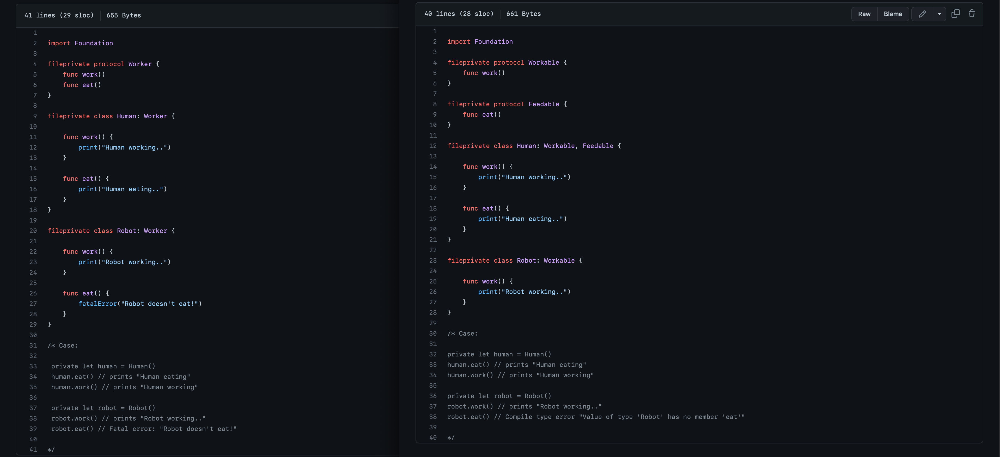
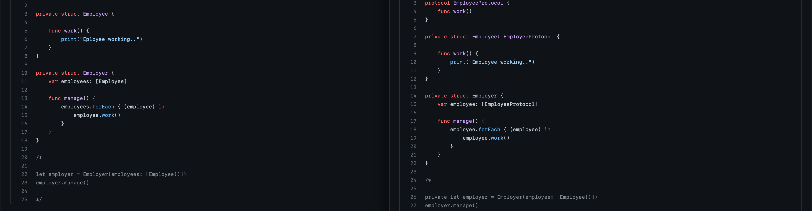

SOLID principles

Principi “S.O.L.I.D.” cosa sono e cosa servono?

Principi che ci aiutano a scrivere un codice chiaro e con meno sforzi, riutilizzabile.

Single Responsibility Principle 

Open/Closed Principle 

Liskov Substitution Principle 

Interface Segregation 

Dependency Inversion

Single Responsibility Principle:

Singola responsabilità. Questo principio afferma che ogni classe/modulo deve avere la propria responsabilità e quindi essere usato per una singola azione.
Prendiamo una classe che fa più cose insieme, spezziamo in singole classi che fanno una cosa precisa, da poter poi chiamare in un Handler che al posto di avere all’interno funzioni che fanno cose e chiamarle, le chiama e basta, lei fa la gestione, le classi separate, loro hanno le funzioni di fare cose.
Pensiamo non nel singolo esempio ma in un futuro dove l’app può essere grande grande. Scalabile

Open/Closed Principle:

Ogni modulo deve poter essere aperto per estendersi e modificarsi esternamente, ma chiuso dal modificarsi internamente.

In primis dobbiamo rispettare il principio della Singola responsabilità. Quindi spezziamo in classi diverse.
Ora vogliamo creare un manager che ha un metodo dove chiama l’azione “paga” per qualsiasi tipo di metodo di pagamento, ma come abbiamo visto in precedenza, non posso specificare nel parametro della funzione il singolo tipo di pagamento accettare… devo renderli generici, con un enum che con uno switch vado a capire chi chiamare? Meh… dopo per ogni nuovo lo devo modificare da più parti! Io devo solo passargli un metodo di pagamento, che poi viene eseguito, trattato in modo generale, quindi… astraggo le classi! Come faccio? Le assegno ad un protocollo di base, quindi loro accettano di essere figlie di… cosi che la funzioni accetta la madre e ciò che c’è indicato dentro al protocollo, da poter utilizzare, come viene poi utilizzato è specifico all’interno di ogni metodo della classe!

Liskov Substitution Principle: 

Le funzioni che usano referenze di una classe dovrebbero poter usare derivate di essa senza saperlo. In sostanza, anche se al posto di usare la madre classe uso la figlia alla funzione non cambia nulla, basta che, come sappiamo, chiamiamo un metodo di base
Concentriamoci non sulle classi ma come viene utilizzata nella funzione

Interface Segregation:

Una classe non dovrebbe essere forzata ad implementare un metodo o parametro che non usa. Bisogna invece, dividere il modulo in più moduli da prendere separatamente, visto che non tutti i metodi sono necessari per farlo lavorare.

Dependency Inversion:

Le classi non devono dipendere una con l’altra ma devono dipendere sulla loro astrazione…
Quindi non creare una classe madre - figlia, che prende le proprietà da essa, devo prendere dal protocollo della madre
Non prendere “quel” modello/classe ma prendi una classe come quella, stesse proprietà

Alcuni principi si somigliano se osserviamo bene, si potrebbe anche mettere tutto in un singolo file e concetto.
Il fatto di rispettare questi principi, cosi come molte cose che spiego aiuta si, ma alcune volte può essere fin troppo giro/lavoro per poco risultato. È sempre buono farlo, ma non bisogna esagerare nel rispettarlo. IMO.
