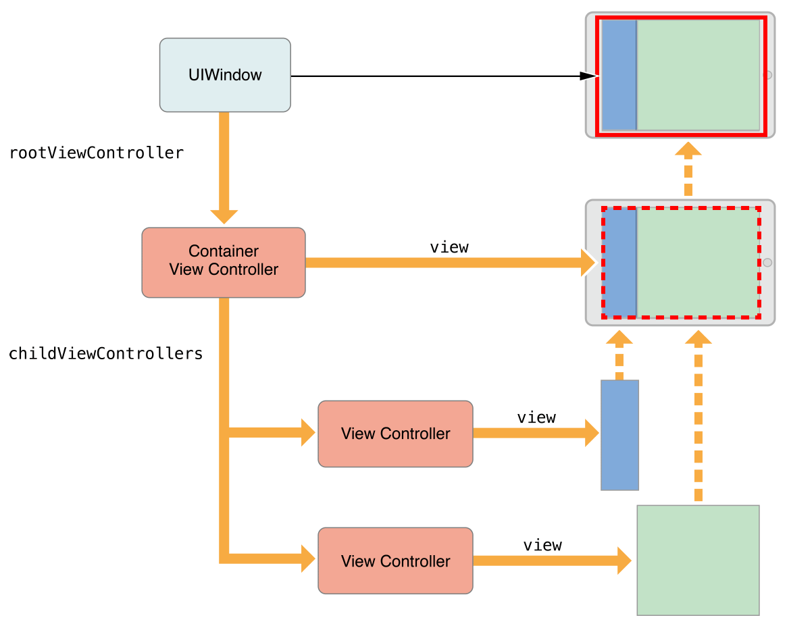

View - ViewController Programming

RootViewController:
Quindi, una volta fatto l’accesso alla nostra app che succede? Abbiamo un punto di ingresso per la nostra view, dato dalla UIWindow!
Questo ingresso è la nostra radice, “Root”ViewController, uno singolo per ogni UIWindow, il quale ha il compito di definire la prima view da fare vedere! Andando a cambiare la view del UIWindow.rootviewcontroller andiamo a cambiare la prima view che vediamo.

Container View Controllers
I container, dal nome, contengono qualcosa, nel nostro caso la view che vogliamo presentare, ma perché dobbiamo usare i container? In realtà possiamo anche non usarli ma al primo caso di “navigazione” dove voglio poter tornare indietro con le pagine, dobbiamo avere un sistema che ci tenga in memoria tutte le schermate passate, in questo caso vengono “sovrapposte”.
Quindi… i container hanno una struttura base: NavigationController, UISplit-View-Controller, UIPageViewController ecc… i quali hanno una vire preimpostata (barra di navigazione) e sotto hanno un contenitore di views, da mostrare.
Solitamente, per ovvie ragioni lo impostiamo come primo controller/view da presentare!

Finalmente andiamo a mostrare la nostra view intesa come… PresentedViewController!
Quando facciamo present, andiamo a rimpiazzare il vecchio contenuto della view con uno nuovo. Se non impostiamo un root inizialmente, andiamo a perdere il vecchio contenuto. In questo caso parliamo proprio di relazione tra presenting-viewcontroller e presented-viewcontroller, il quale sostituisce il vecchio, perdiamo tutto di esso.
Cosa facciamo se vogliamo fare la navigazione? Usiamo un container controller, tipo navigationcontroller, che lui gestisce da solo questa cosa, sostituendo il controller, andandoli sopra, non rimpiazzando

Gestire interazioni tra controller
Dobbiamo trattare ogni singola view come un'isola a sé stante, i controller non devono conoscere i vari stati del nuovo controller o altro.
Nel caso in cui si debbano passare dei dati, devono essere costruiti come public interface, quindi che accettino dati di ingresso da una qualsiasi view generale e non da una specifica, insomma devono avere il dato più generale possibile, e come abbiamo visto in passato nella programmazione funzionale…. Riutilizzabile!
Solitamente in UIKit si usa il Delegation pattern, il quale tramite dei protocolli faccio si che la mia view abbia dei metodi che eredita dal protocollo, cosi quando il protocollo chiama le funzioni, qualsiasi view che lo ha, esegue quella azione, cosi è generico.

Ma prima, cos’è una view?

Parliamo di View in swiftui, in uikit solitamente parliamo di UIViewController
View controller sono la parte fondamentale della app, i quali gestiscono le interazioni utente e i dati della app. Ne posso avere molteplici
Solitamente creiamo una subclass di UIViewController, il quale ha delle funzioni già annesse e una sua gestione interna.
Il ruolo principale di esso è coordinare le sue child view, esistono anche le container view controller che gestiscono più controller al suo interno, al posto di sole views.

Il ciclo di vita di un controller, come per l'app (architettura), abbiamo che al root viene assegnata un controller, il quale chiama:
AwakeFromNib: quindi carichiamo il file. La view è vuota
ViewDidLoad: la view è stata caricata
ViewWillAppear: about to appear
ViewDidAppear: è stata presentata all'utente

Ora.. come si gestiscono le interazioni utente nella schermata? 
I Controller hanno dei metodi che gestiscono queste interazioni direttamente, chiamati Outlet, i quali accettano interazioni, e hanno anche il metodo per riconoscere i gesti utente, tipo degli swipe.
Tutti questi metodi, poi tramite le funzioni che andiamo a collegare, IBOutlet func (sender) andiamo a far fare cose all’arrivo dell'evento!

View layout 
Andando avanti nel tempo abbiamo le cose sempre più facilitate, con lo storyboard dovevamo gestire i constraints ecc, con swiftui è molto più veloce e pratico, prima andavamo a creare l'interfaccia visivamente, ora, tramite codice.

Gestire la memoria con i vari metodi del controller
Init > carichiamo i dati che ci servono, come abbiamo visto nel ciclo della app.
viewDidLoad > carichiamo qualsiasi oggetto che vogliamo andare a mostrare.
didReceiveMemoryWarning > quando viene chiamata questa funzione (delegate pattern), la view consuma troppi dati, andiamo a scaricare i dati non critici per il funzionamento direttamente qui.
delloc > dichiaro di rilasciare dati che possibilmente non sono stati rilasciati.

Mi raccomando, la view deve gestire meno dati possibili, quindi, fare meno lavoro possibile, come possiamo fare a farglielo fare esternamente? MVC!
